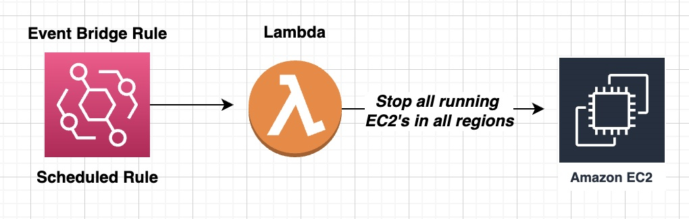

# devsecops-class-boto3-automation

## Steps to deploy

```
terraform init -reconfigure -input=false -backend-config="backend.tfconfig"

terraform validate

terraform fmt --recursive

terraform plan

terraform apply -auto-approve
```

## Lambda will invoke based on the schedule

 <br>


